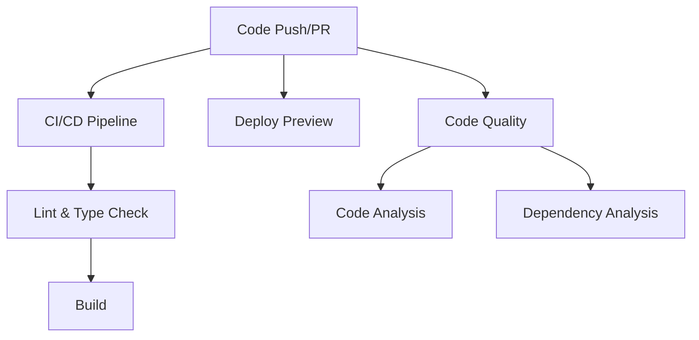

# CI/CD Workflows Documentation

This directory contains GitHub Actions workflows for automated testing, building, and quality assurance of the portfolio project.

## 🚀 Workflows Overview

### 1. **CI/CD Pipeline** (`ci.yml`)
**Triggers:** Push to main/master, Pull Requests to main/master

**Purpose:** Main continuous integration pipeline that ensures code quality and build integrity.

**Jobs:**
- **Lint and Type Check**: Runs ESLint and TypeScript type checking on Node.js 16.x and 18.x
- **Build**: Creates production build and uploads artifacts
- **Security Audit**: Checks for security vulnerabilities in dependencies
- **Dependency Check**: Validates package-lock integrity and checks for outdated packages

**What it does:**
- ✅ Validates code style and formatting
- ✅ Ensures TypeScript types are correct
- ✅ Verifies the application builds successfully
- ✅ Scans for security vulnerabilities
- ✅ Checks dependency health

### 2. **Deploy Preview** (`deploy-preview.yml`)
**Triggers:** Pull Requests (opened, synchronize, reopened)

**Purpose:** Creates preview builds for pull requests to test changes before merging.

**Features:**
- 📦 Generates preview build artifacts
- 💬 Comments on PR with build details
- 🔗 Provides download links for testing
- ⏰ Retains artifacts for 7 days

### 3. **Code Quality** (`code-quality.yml`)
**Triggers:** Push to main/master, Pull Requests, Weekly schedule (Sundays)

**Purpose:** Provides detailed code analysis and quality reporting.

**Jobs:**
- **Code Analysis**: 
  - Generates ESLint reports in JSON format
  - Creates TypeScript error reports
  - Measures build size
  - Comments PR with quality summary
- **Dependency Analysis**:
  - Analyzes bundle composition
  - Checks for unused dependencies
  - Generates dependency reports

## 📋 Workflow Status Badges

Add these badges to your README.md to show workflow status:

```markdown


```

## 🔧 Configuration

### Node.js Versions
The workflows test against Node.js 16.x and 18.x to ensure compatibility.

### Caching
All workflows use npm caching to speed up dependency installation.

### Artifacts
- **Build artifacts**: Retained for 1 day (main CI)
- **Preview builds**: Retained for 7 days
- **Quality reports**: Retained for 30 days
- **Dependency reports**: Retained for 7 days

## 🛠️ Customization

### Adding Tests
If you add a test suite to your project, update the CI workflow:

```yaml
- name: Run tests
  run: npm test
```

### Changing Node.js Versions
Update the matrix strategy in `ci.yml`:

```yaml
strategy:
  matrix:
    node-version: [18.x, 20.x]  # Add or remove versions
```

### Adding Environment Variables
For builds that require environment variables:

```yaml
- name: Build application
  run: npm run build
  env:
    NEXT_PUBLIC_API_URL: ${{ secrets.API_URL }}
```

## 📊 Reports and Artifacts

### Accessing Reports
1. Go to the Actions tab in your GitHub repository
2. Click on a completed workflow run
3. Scroll down to the "Artifacts" section
4. Download the reports you need

### Report Types
- **ESLint Report**: JSON format with detailed linting results
- **TypeScript Report**: Text file with type checking errors
- **Build Size Report**: Size of the generated build
- **Dependency Report**: Analysis of unused dependencies

## 🚨 Troubleshooting

### Common Issues

**Build Failures:**
- Check if all dependencies are correctly listed in `package.json`
- Ensure no TypeScript errors exist
- Verify ESLint configuration is correct

**Security Audit Failures:**
- Update vulnerable dependencies: `npm audit fix`
- For high-severity issues that can't be auto-fixed, consider alternative packages

**Out of Memory Errors:**
- Increase Node.js memory limit in workflow:
  ```yaml
  - name: Build with more memory
    run: NODE_OPTIONS="--max-old-space-size=4096" npm run build
  ```

## 💡 Best Practices

1. **Always run workflows locally first** using `npm run lint` and `npm run build`
2. **Keep dependencies updated** to avoid security vulnerabilities
3. **Monitor workflow performance** and optimize if builds become slow
4. **Use semantic commit messages** for better change tracking
5. **Review PR comments** generated by quality workflows

## 🔄 Workflow Dependencies



The workflows are designed to run in parallel for efficiency while maintaining proper dependencies between critical checks and builds. 